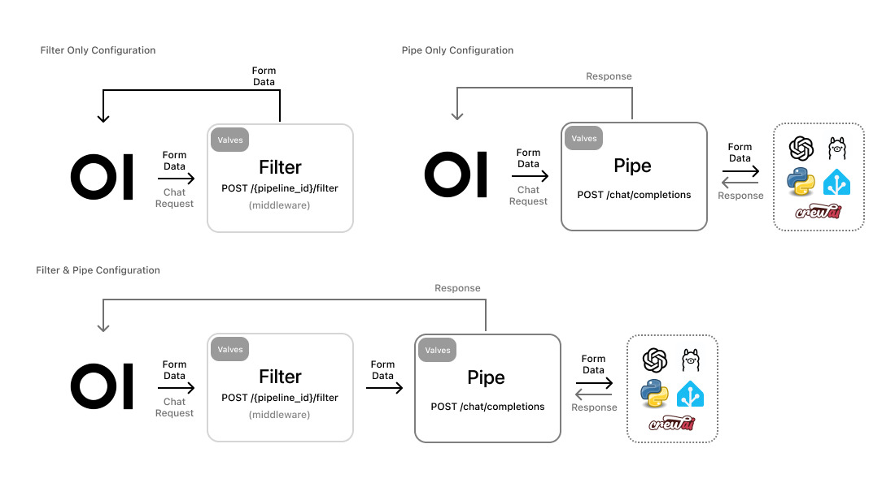

<p align="center">
  <a href="#"></a>
</p>

# Pipelines: UI-Agnostic OpenAI API Plugin Framework

> [!TIP]
> **DO NOT USE PIPELINES!**
>
> If your goal is simply to add support for additional providers like Anthropic or basic filters, you likely don't need Pipelines . For those cases, Open WebUI Functions are a better fit—it's built-in, much more convenient, and easier to configure. Pipelines, however, comes into play when you're dealing with computationally heavy tasks (e.g., running large models or complex logic) that you want to offload from your main Open WebUI instance for better performance and scalability.


Welcome to **Pipelines**, an [Open WebUI](https://github.com/open-webui) initiative. Pipelines bring modular, customizable workflows to any UI client supporting OpenAI API specs – and much more! Easily extend functionalities, integrate unique logic, and create dynamic workflows with just a few lines of code.

## 🚀 Why Choose Pipelines?

- **Limitless Possibilities:** Easily add custom logic and integrate Python libraries, from AI agents to home automation APIs.
- **Seamless Integration:** Compatible with any UI/client supporting OpenAI API specs. (Only pipe-type pipelines are supported; filter types require clients with Pipelines support.)
- **Custom Hooks:** Build and integrate custom pipelines.

### Examples of What You Can Achieve:

- [**Function Calling Pipeline**](/examples/filters/function_calling_filter_pipeline.py): Easily handle function calls and enhance your applications with custom logic.
- [**Custom RAG Pipeline**](/examples/pipelines/rag/llamaindex_pipeline.py): Implement sophisticated Retrieval-Augmented Generation pipelines tailored to your needs.
- [**Message Monitoring Using Langfuse**](/examples/filters/langfuse_filter_pipeline.py): Monitor and analyze message interactions in real-time using Langfuse.
- [**Message Monitoring Using Opik**](/examples/filters/opik_filter_pipeline.py): Monitor and analyze message interactions using Opik, an open-source platform for debugging and evaluating LLM applications and RAG systems.
- [**Rate Limit Filter**](/examples/filters/rate_limit_filter_pipeline.py): Control the flow of requests to prevent exceeding rate limits.
- [**Real-Time Translation Filter with LibreTranslate**](/examples/filters/libretranslate_filter_pipeline.py): Seamlessly integrate real-time translations into your LLM interactions.
- [**Toxic Message Filter**](/examples/filters/detoxify_filter_pipeline.py): Implement filters to detect and handle toxic messages effectively.
- **And Much More!**: The sky is the limit for what you can accomplish with Pipelines and Python. [Check out our scaffolds](/examples/scaffolds) to get a head start on your projects and see how you can streamline your development process!

## 🔧 How It Works

<p align="center">
  <a href="./docs/images/workflow.png"></a>
</p>

Integrating Pipelines with any OpenAI API-compatible UI client is simple. Launch your Pipelines instance and set the OpenAI URL on your client to the Pipelines URL. That's it! You're ready to leverage any Python library for your needs.

## ⚡ Quick Start with Docker

> [!WARNING]
> Pipelines are a plugin system with arbitrary code execution — **don't fetch random pipelines from sources you don't trust**.

### Docker

For a streamlined setup using Docker:

1. **Run the Pipelines container:**

   ```sh
   docker run -d -p 9099:9099 --add-host=host.docker.internal:host-gateway -v pipelines:/app/pipelines --name pipelines --restart always ghcr.io/open-webui/pipelines:main
   ```

2. **Connect to Open WebUI:**

   - Navigate to the **Settings > Connections > OpenAI API** section in Open WebUI.
   - Set the API URL to `http://localhost:9099` and the API key to `0p3n-w3bu!`. Your pipelines should now be active.

> [!NOTE]
> If your Open WebUI is running in a Docker container, replace `localhost` with `host.docker.internal` in the API URL.

3. **Manage Configurations:**

   - In the admin panel, go to **Admin Settings > Pipelines tab**.
   - Select your desired pipeline and modify the valve values directly from the WebUI.

> [!TIP]
> If you are unable to connect, it is most likely a Docker networking issue. We encourage you to troubleshoot on your own and share your methods and solutions in the discussions forum.

If you need to install a custom pipeline with additional dependencies:

- **Run the following command:**

  ```sh
  docker run -d -p 9099:9099 --add-host=host.docker.internal:host-gateway -e PIPELINES_URLS="https://github.com/open-webui/pipelines/blob/main/examples/filters/detoxify_filter_pipeline.py" -v pipelines:/app/pipelines --name pipelines --restart always ghcr.io/open-webui/pipelines:main
  ```

Alternatively, you can directly install pipelines from the admin settings by copying and pasting the pipeline URL, provided it doesn't have additional dependencies.

That's it! You're now ready to build customizable AI integrations effortlessly with Pipelines. Enjoy!

### Docker Compose together with Open WebUI

Using [Docker Compose](https://docs.docker.com/compose/) simplifies the management of multi-container Docker applications.

Here is an example configuration file `docker-compose.yaml` for setting up Open WebUI together with Pipelines using Docker Compose:

```yaml
services:
  openwebui:
      image: ghcr.io/open-webui/open-webui:main
      ports:
        - "3000:8080"
      volumes:
        - open-webui:/app/backend/data

  pipelines:
      image: ghcr.io/open-webui/pipelines:main
      volumes:
        - pipelines:/app/pipelines
      restart: always
      environment:
        - PIPELINES_API_KEY=0p3n-w3bu!

volumes:
  open-webui: {}
  pipelines: {}
```

To start your services, run the following command:

```
docker compose up -d
```

You can then use `http://pipelines:9099` (the name is the same as the service's name defined in `docker-compose.yaml`) as an API URL to connect to Open WebUI.

> [!NOTE]
> The `pipelines` service is accessible only by `openwebui` Docker service and thus provide additional layer of security.

## 📦 Installation and Setup

Get started with Pipelines in a few easy steps:

1. **Ensure Python 3.11 is installed.**
2. **Clone the Pipelines repository:**

   ```sh
   git clone https://github.com/open-webui/pipelines.git
   cd pipelines
   ```

3. **Install the required dependencies:**

   ```sh
   pip install -r requirements.txt
   ```

4. **Start the Pipelines server:**

   ```sh
   sh ./start.sh
   ```

Once the server is running, set the OpenAI URL on your client to the Pipelines URL. This unlocks the full capabilities of Pipelines, integrating any Python library and creating custom workflows tailored to your needs.

### Advanced Docker Builds
If you create your own pipelines, you can install them when the Docker image is built.  For example,
create a bash script with the snippet below to collect files from a path, add them as install URLs, 
and build the Docker image with the new pipelines automatically installed.

NOTE: The pipelines module will still attempt to install any package dependencies found at in your
file headers at start time, but they will not be downloaded again.

```sh
# build in the specific pipelines
PIPELINE_DIR="pipelines-custom"
# assuming the above directory is in your source repo and not skipped by `.dockerignore`, it will get copied to the image
PIPELINE_PREFIX="file:///app"

# retrieve all the sub files
export PIPELINES_URLS=
for file in "$PIPELINE_DIR"/*; do
    if [[ -f "$file" ]]; then
        if [[ "$file" == *.py ]]; then
            if [ -z "$PIPELINES_URLS" ]; then
                PIPELINES_URLS="$PIPELINE_PREFIX/$file"
            else
                PIPELINES_URLS="$PIPELINES_URLS;$PIPELINE_PREFIX/$file"
            fi
        fi
    fi
done
echo "New Custom Install Pipes: $PIPELINES_URLS"

docker build --build-arg PIPELINES_URLS=$PIPELINES_URLS --build-arg MINIMUM_BUILD=true -f Dockerfile .
```

## 📂 Directory Structure and Examples

The `/pipelines` directory is the core of your setup. Add new modules, customize existing ones, and manage your workflows here. All the pipelines in the `/pipelines` directory will be **automatically loaded** when the server launches.

You can change this directory from `/pipelines` to another location using the `PIPELINES_DIR` env variable.

### Integration Examples

Find various integration examples in the `/examples` directory. These examples show how to integrate different functionalities, providing a foundation for building your own custom pipelines.

## 🎉 Work in Progress

We’re continuously evolving! We'd love to hear your feedback and understand which hooks and features would best suit your use case. Feel free to reach out and become a part of our Open WebUI community!

Our vision is to push **Pipelines** to become the ultimate plugin framework for our AI interface, **Open WebUI**. Imagine **Open WebUI** as the WordPress of AI interfaces, with **Pipelines** being its diverse range of plugins. Join us on this exciting journey! 🌍
